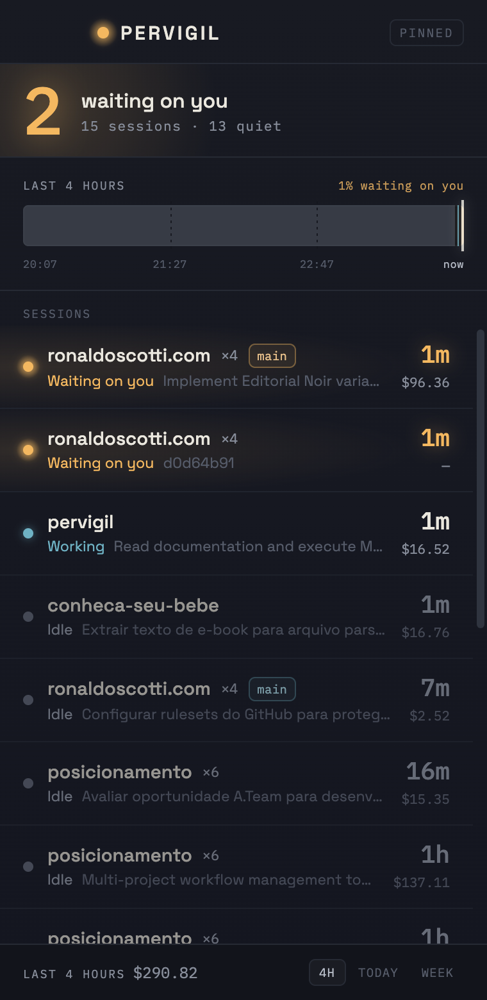

# Pervigil

**A pinned desktop panel for your Claude Code sessions.** See every session across
every project, which ones are **waiting on you**, and what your day actually looked
like — at a glance.

> *pervigil* (Latin) — ever-watchful; keeping watch through the whole night.

<p align="center">
  
</p>

---

## Why

Running many Claude Code sessions across many projects, work falls through the
cracks: a session finishes unnoticed, or sits **blocked on your input** while
you're heads-down elsewhere. The category is validated but every incumbent is
macOS-only and read-only. Pervigil's two wedges:

- **"Waiting on you" is the organizing principle** — the urgent state sorts to the
  top and is the whole point, not one column among many. A native notification fires
  the moment a session enters it.
- **Cross-platform by architecture** — one Rust/Tauri core, per-OS adapters behind
  traits, with honest capability detection. macOS is the tested target; Windows and
  Linux are architecturally supported and open for contribution.

Plus what you'd expect once it's watching: a combined **activity lane** with a
"% waiting on you" stat, per-session and per-window **cost** from a shipped price
table, **click-to-focus** to jump to a session's terminal, and **pin / dismiss /
project visibility**.

*(Full design: [`docs/specs/2026-07-23-pervigil-design.md`](docs/specs/2026-07-23-pervigil-design.md).)*

## How it works

```
Claude Code session
   │  SessionStart / Notification / Stop / UserPromptSubmit hooks
   ▼
hook shim ──► `pervigil record`  (bundled CLI, atomic append, always exit 0)
                    │
        ~/.pervigil/events.jsonl        ← source of truth for state
                    +
   ~/.claude/projects/**/*.jsonl        ← second input: tokens → cost, session title
                    │
                    ▼
             pure Rust core  ──  fold(events) → sessions,  timeline(events) → lane
                    │
                    ▼
          Tauri v2 panel + tray badge
```

Two design decisions carry the whole thing:

- **An event-log file, not a daemon.** The app isn't always running — the core case
  is a closed laptop with a session left blocked. An append-only file plus
  fold-on-launch reconstructs exact state across restarts, crashes, and reboots, with
  no socket, port, or IPC, identically on all three platforms.
- **`store` is a pure function** — `fold(events, now, prefs) -> sessions`, no clock,
  no filesystem, no GUI. That's what makes the heart of the product a fixture test
  instead of a UI harness. Two inputs (hooks → state, transcripts → cost) fail
  independently: no hooks installed → sessions and cost still render, state degrades
  to `idle`.

## Cross-platform posture

Portable for free (pure data from `~/.claude` + hooks): session discovery, state,
lane, cost. Platform-specific, **degrading honestly**:

| Feature          | macOS              | Windows   | Linux X11 | Linux Wayland            |
|------------------|--------------------|-----------|-----------|--------------------------|
| Tray icon        | ✅                 | ✅        | ⚠️        | ⚠️                       |
| Click-to-focus   | ✅ AX / AppleScript | ✅ Win32 | ✅ wmctrl | ❌ blocked by compositor |
| Always-on-top    | ✅                 | ✅        | ✅        | ⚠️                       |

Click-to-focus is tiered and best-available: tmux pane → iTerm2 tab → VS Code folder
→ copy the resume command (the universal floor, so it never fully fails).
**Correct-but-coarse beats precise-but-wrong** — pervigil never raises a guessed
window. Where a platform blocks a capability (Wayland activation), it says so and
falls back rather than pretending.

## Install (from source)

macOS, with a Rust toolchain and Node:

```bash
git clone <this repo> && cd pervigil
npm install
npm run tauri dev      # run it
npm run tauri build    # or build a bundle
```

Then open **Settings** in the panel and paste the shown hook snippet into
`~/.claude/settings.json` — pervigil never edits that file for you. The panel's
install card disappears the moment the hooks are detected.

## Status

Built through **M9** of the plan — click-to-focus, notifications, config,
pin/dismiss, project visibility, and the hook-install card are all implemented and
QA'd, on a pure core with **103 tests**. Remaining: **M10 — a signed/notarized
build and the demo capture.**

Verified honestly. The pure logic and the checkable side effects (clipboard copy,
config and snippet round-trips, tier selection) are tested; three OS-surface effects
are real code but **not yet visually confirmed** on the dev machine — the on-screen
window raise for tmux/iTerm2, the macOS tray badge, and the notification banner (that
box has neither tmux nor iTerm2, and the CI/dev environment can't capture the native
surfaces). See [`docs/qa/`](docs/qa/) for what each milestone did and did not prove.

## Built in the open, by an explicit method

This repo is also a demonstration. Pervigil is built with a disciplined, spec-first,
review-gated AI-assisted workflow, and the repo is the **honest record** of it — not
a description. Every stage deposits a real artifact; the git history records the
order; nothing is claimed ahead of where the work actually is. Read
[`docs/method/`](docs/method/) to follow it, or the git log to verify it.

## License

TBD.
