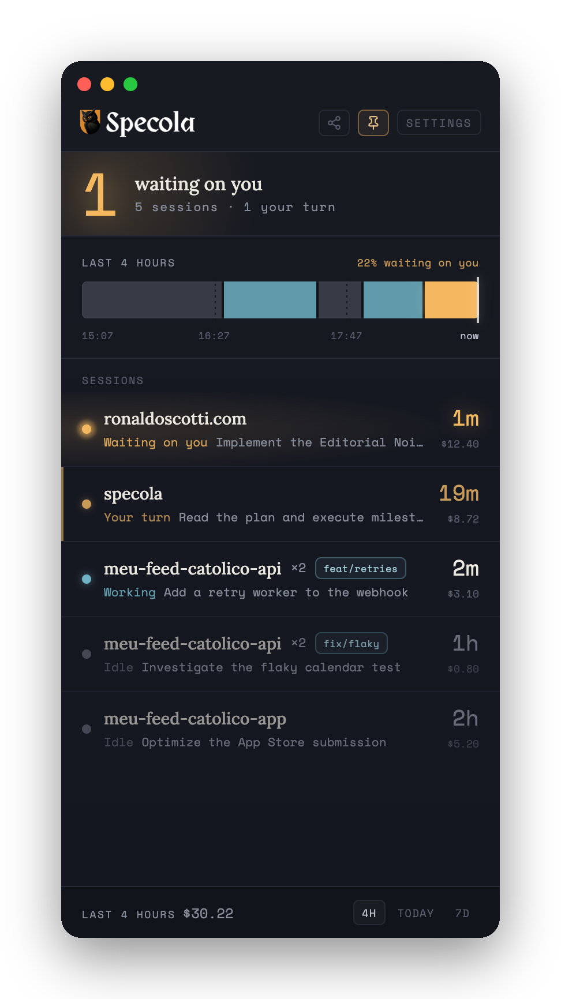
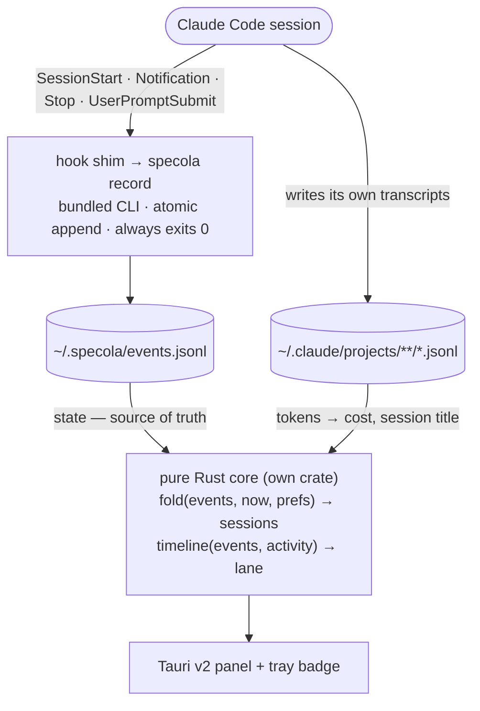

<p align="center">
  <picture>
    <source media="(prefers-color-scheme: dark)" srcset="assets/logo-light.png">
    
  </picture>
</p>

**A pinned desktop panel for your Claude Code sessions.** See every session across
every project, which ones are **waiting on you**, and what your day actually looked
like — at a glance.

> *specola* — a watchtower; the raised place you keep watch from. Also the
> *Specola Vaticana*, the Vatican Observatory.

> **macOS is the tested target.** Windows and Linux ship from the same CI pipeline
> and the platform code is real, but neither has run on a maintainer's machine yet.
> [Testers wanted](CONTRIBUTING.md).

<p align="center">
  
</p>

<sub align="center">Rendered from the real UI with fixed mock data — regenerate any time with <code>bash scripts/screenshot.sh</code>.</sub>

---

## Why

Running many Claude Code sessions across many projects, work falls through the
cracks: a session finishes unnoticed, or sits **blocked on your input** while
you're heads-down elsewhere. Specola is built around exactly that:

- **"Waiting on you" is the organizing principle** — the urgent state sorts to the
  top and is the whole point, not one column among many. A native notification fires
  the moment a session enters it.
- **Cross-platform by architecture** — one Rust/Tauri core, per-OS adapters behind
  traits, with honest capability detection. macOS is the tested target; Windows and
  Linux are architecturally supported and open for contribution.

Plus what you'd expect once it's watching: a combined **activity lane** with a
"% waiting on you" stat, per-session and per-window **cost** from a shipped price
table, **click-to-focus** to jump to a session's terminal, **pin / dismiss (hide or
mark-as-read) / project visibility**, **launch-at-login** and single-instance, a
**ten-language** UI (with RTL), a privacy-safe **share-your-day** card, and
**auto-update** from signed CI releases.

*(Full design: [`docs/specs/2026-07-23-pervigil-design.md`](docs/specs/2026-07-23-pervigil-design.md).)*

## How it works



Two design decisions carry the whole thing:

- **An event-log file, not a daemon.** The app isn't always running — the core case
  is a closed laptop with a session left blocked. An append-only file plus
  fold-on-launch reconstructs exact state across restarts, crashes, and reboots, with
  no socket, port, or IPC, identically on all three platforms.
- **`store` is a pure function** — `fold(events, now, prefs) -> sessions`, no clock,
  no filesystem, no GUI. That's what makes the heart of the product a fixture test
  instead of a UI harness. Two inputs (hooks → state, transcripts → cost) fail
  independently: no hooks installed → sessions and cost still render, state degrades
  to `idle`.

## Cross-platform posture

Portable for free (pure data from `~/.claude` + hooks): session discovery, state,
lane, cost. Platform-specific, **degrading honestly**:

| Feature          | macOS              | Windows   | Linux X11 | Linux Wayland            |
|------------------|--------------------|-----------|-----------|--------------------------|
| Tray icon        | ✅                 | ✅        | ⚠️        | ⚠️                       |
| Click-to-focus   | ✅ AX / AppleScript | ✅ Win32 | ✅ wmctrl | ❌ blocked by compositor |
| Always-on-top    | ✅                 | ✅        | ✅        | ⚠️                       |

Click-to-focus is tiered and best-available: tmux pane → iTerm2 tab → VS Code folder
→ copy the resume command (the universal floor, so it never fully fails).
**Correct-but-coarse beats precise-but-wrong** — specola never raises a guessed
window. Where a platform blocks a capability (Wayland activation), it says so and
falls back rather than pretending.

## Install

Download from the
**[latest release](https://github.com/ronaldoscotti/specola/releases/latest)**.

| If you're on | Download the file ending in | What to expect |
|---|---|---|
| **macOS**, Apple silicon (M1–M4) | `_aarch64.dmg` | Signed and notarized — opens normally. |
| **macOS**, Intel | `_x64.dmg` | Signed and notarized — opens normally. |
| **Windows** | `_x64-setup.exe` | **Not code-signed yet** — see below. |
| **Linux**, anything | `_amd64.AppImage` | `chmod +x` and run, no install. |
| **Linux**, Debian/Ubuntu | `_amd64.deb` | |
| **Linux**, Fedora/RHEL | `.x86_64.rpm` | |

Everything else on the releases page — `latest.json`, `.app.tar.gz`, and the `.sig`
files — is auto-updater plumbing. You don't need to download any of it.

**Windows: SmartScreen will warn you.** The installer isn't code-signed yet, so
Windows shows *"Windows protected your PC"*. To install anyway: **More info →
Run anyway**. If that trade isn't one you want to make, build from source below —
it's the same code. Signing is [planned](CONTRIBUTING.md); note that even a signed
installer keeps warning until it accumulates download reputation, so this won't
vanish the day it's signed.

**Linux:** the tray icon depends on your desktop having an app-indicator
implementation, and on Wayland the compositor blocks window activation —
click-to-focus falls back to copying the resume command rather than raising a
window. Both are documented behavior, not bugs; anything else is, and a
[report](https://github.com/ronaldoscotti/specola/issues/new?template=platform_test.yml)
is genuinely useful.

### Then wire up the hooks

Open **Settings** in the panel and paste the shown hook snippet into
`~/.claude/settings.json` — Specola never edits that file for you. The panel's
install card disappears the moment the hooks are detected.

### Or build from source

A [Rust toolchain](https://rustup.rs) and Node 18+:

```bash
git clone https://github.com/ronaldoscotti/specola.git && cd specola
npm install
npm run tauri dev      # run it
npm run tauri build    # or build a bundle
```

Linux needs system dependencies first — see [CONTRIBUTING.md](CONTRIBUTING.md).

## Status

Built through **M10 and beyond** — click-to-focus (confirmed raising the window
under a real GUI launch), notifications, config, pin/dismiss, project visibility,
the hook-install card, **ten UI languages** (with RTL), launch-at-login,
single-instance, the dismiss "read" mode, a **share-your-day** card, and
**auto-updating, signed + notarized releases from CI** — on a pure core, now a crate
of its own, with **169 tests** plus 20 on the frontend. A short demo is at the top;
the release pipeline is proven end-to-end — a tag produces signed mac/Windows/Linux
bundles plus the updater manifest. Version bumps and tagging now go through
release-please; that path ships its first release with 0.2.0.

Verified honestly. The pure logic and the checkable side effects (clipboard copy,
config and snippet round-trips, tier selection, the dismiss modes) are tested; three
OS-surface effects are real code but **not yet visually confirmed** on the dev
machine — the on-screen window raise for tmux/iTerm2, the macOS tray badge, and the
notification banner (that box has neither tmux nor iTerm2, and the CI/dev environment
can't capture the native surfaces). See [`docs/qa/`](docs/qa/) for what each
milestone did and did not prove.

## Built in the open, by an explicit method

This repo is also a demonstration. Specola is built with a disciplined, spec-first,
review-gated AI-assisted workflow, and the repo is the **honest record** of it — not
a description. Every stage deposits a real artifact; the git history records the
order; nothing is claimed ahead of where the work actually is. Read
[`docs/method/`](docs/method/) to follow it, or the git log to verify it.

The core (M0–M10) went through the full pipeline — spec, plan, TDD, review — with the
artifacts in `docs/`. The features added after launch were built in a faster loop:
test-driven cores, agent-browser QA, and reviewed pull requests, but a written spec
only where it earned one (the [release/auto-update spec](docs/specs/2026-07-24-auto-update-releases.md);
the settings, dismiss modes, and share card shipped without one). The repo says so
rather than back-dating specs it never wrote.

## License

[MIT](LICENSE) © 2026 Ronaldo Scotti

---

Built by **Ronaldo Scotti** — [ronaldoscotti.com](https://ronaldoscotti.com)
