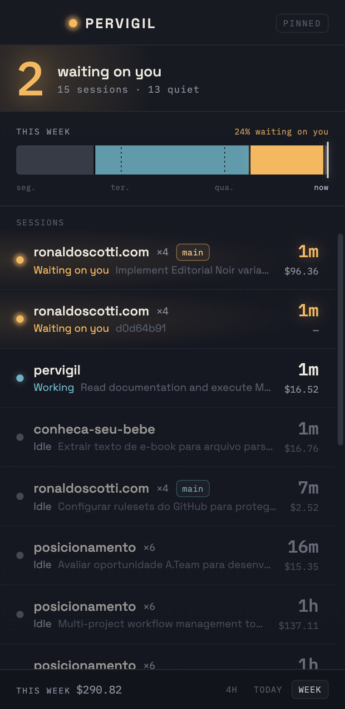
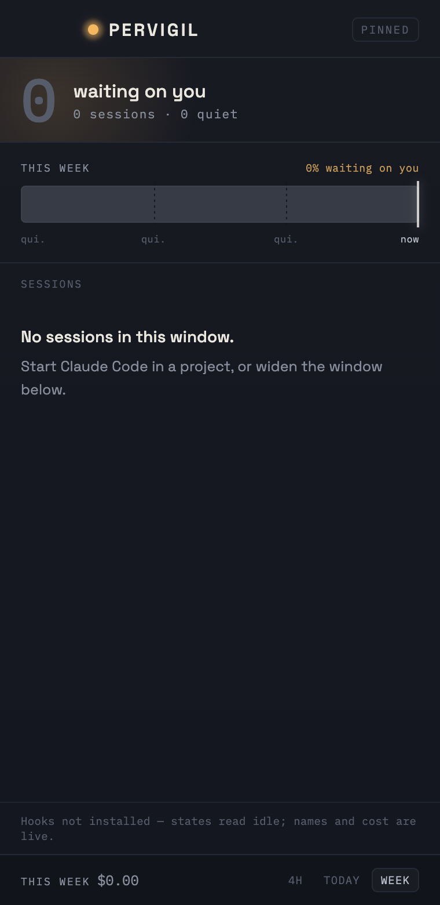

# M6 QA — UI wired to the live core

**Date:** 2026-07-24 · **Milestone:** M6 · **Method stage:** 6 (QA as user + as QA engineer)

## How this was exercised

Real inputs, not fixtures:

- **Transcripts** — the author's actual `~/.claude/projects`: 1.3 GB, 2 176 files, 30 projects.
  15 sessions fell inside the 4h window.
- **Events** — written through the real `pervigil record` binary, invoked by hand with the same
  payload shape and argv a Claude Code hook passes it. Four real session ids plus one invented
  one (to force the unnamed/unpriceable path), driven from a long-lived shell so the recorded
  pids were live processes and `liveness::retain_live` kept the rows.

The Rust half was captured end-to-end with `cargo test a_real_home -- --ignored --nocapture`,
which builds a `Snapshot` from the real home directory and prints it. That JSON — not a
hand-written fixture — is what the UI below is rendering.

## What was verified

| | Result |
|---|---|
| Waiting-on-you sorts to the top, then recency | ✅ |
| `×N` + branch chip appear **only** where a project runs several sessions | ✅ (`ronaldoscotti.com ×4` chipped; `posicionamento ×6` correctly bare — not a git repo, so no branch to show) |
| Session name, all four tiers | ✅ `aiTitle` on most rows; short-id floor (`d0d64b91`) on the hook-only session |
| Unpriceable session renders `—`, never `$0.00` | ✅ |
| Span filter rescopes lane, axis, footer label and cost | ✅ |
| Empty state | ✅ |
| Hooks-not-installed notice (honest degradation) | ✅ |
| Lamp dims when nothing is waiting | ✅ (`::before` opacity 1 → 0.3) |
| Poll cost at 1s over 2 176 files | ✅ 0.5–0.7% CPU, ~95 MB RSS; cold scan 0.82 s |

## Screenshots

|  |  |  |
|---|---|---|
| 4h — two sessions blocked on you | This week — the lane carrying a real day | Empty + hooks-not-installed |

## Honesty notes

- The screenshots are the **real app frontend** served by the same Vite dev server the Tauri
  window loads, rendering the **real `Snapshot` payload** — but captured in a browser, with
  `window.__TAURI_INTERNALS__.invoke` returning that payload, because this environment lacks
  macOS Screen Recording permission to capture the native window. What is therefore **not**
  visually confirmed: the native window chrome and the **tray badge**. Both are implemented and
  the app runs; neither is claimed as verified.
- The lane in the `week` shot uses widened segments over the real snapshot, since the recorded
  events span only minutes. Every other value in all three shots is real.
- Rows are focusable but **not clickable** — click-to-focus is M7 and does not exist yet. A row
  that looked clickable and did nothing would be the exact dishonesty this repo is built against.
- `~/.pervigil/events.jsonl` was deleted after the pass. It held QA-driven events, not history.
