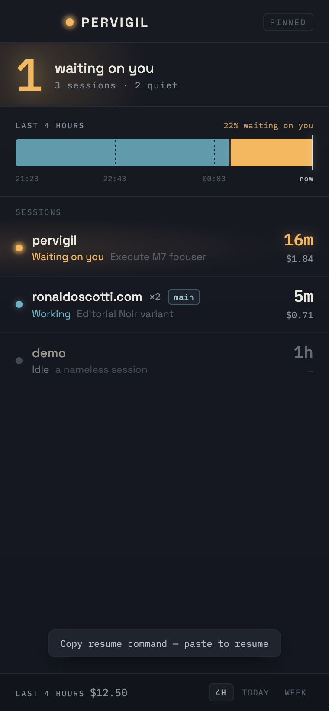

# M7 QA — the focuser (click-to-focus)

**Date:** 2026-07-24 · **Milestone:** M7 · **Method stage:** 6 (QA as user + as QA engineer)

## What M7 adds

Click a row (or press Enter) → jump to that session's terminal. Four best-available tiers
(spec §5): tmux pane → iTerm2 tab → VS Code folder → copy the resume command. The terminal
context is captured by the `record` shim at `SessionStart` — the one moment pervigil is inside
the session's own process tree — and rides on the event log.

## Verification matrix

| Claim | How | Result |
|---|---|---|
| tier selection: tmux ≻ iTerm2 ≻ VS Code ≻ clipboard | unit (`focuser::select`) | ✅ 7 tests |
| a tier whose binary is absent is skipped, never guessed | unit | ✅ |
| capability detection maps `PATH` + platform to `Caps` | unit | ✅ |
| executor argv per tier (tmux/iterm/vscode/pbcopy) | unit, recording runner | ✅ 4 tests |
| `SystemRunner` really works | **live** pbcopy→pbpaste round-trip | ✅ `real_pbcopy … --ignored` |
| shim captures `program` / `tmux_pane` / `iterm_session` from env | **live** — drove the real `record` binary, read `events.jsonl` | ✅ all three fields present |
| capture → fold → select end to end (VS Code) | **live** — drove a `SessionStart` on this VS Code box; snapshot row reported `focus: "Open in VS Code"` | ✅ |
| outcome shaping: raised / copied / failed | unit | ✅ 3 tests |
| row is a keyboard-operable button with an honest tooltip | `agent-browser` — `role=button`, `title`, `tabindex=0` | ✅ |
| click and Enter both activate; toast reports the action | `agent-browser` — copy row → "Copy resume command — paste to resume"; VS Code row via Enter → "Open in VS Code" | ✅ |
| no horizontal overflow | `agent-browser` — `scrollWidth == clientWidth` | ✅ |

## The clipboard floor replaced the "disabled row"

The plan sketched a `Degraded(reason)` outcome rendering a **disabled** row with a tooltip. In
building it that state turned out never to occur: the resume command needs only the session id,
which every row has, so the clipboard tier is a universal floor and **every row is actionable**.
Rather than invent a disabled state that can't happen, the row always acts and its tooltip states
*how precise* the action is ("Jump to pane" vs "Copy resume command"). That is the spec's intent —
"tooltip explains" — met more honestly. Recorded here so it isn't read as a dropped requirement.

## Not verified here (honest gaps)

- **Actually raising a tmux pane / iTerm2 tab / VS Code window** on screen. This box has neither
  tmux nor iTerm2 installed (`Caps { tmux:false, iterm:true, code:true }`), and capturing the
  native raise needs Screen Recording permission this environment lacks. The argv each tier emits
  is unit-tested and `pbcopy` is proven live; the on-screen raise is **real code, manually
  unverified** — same posture as M6's tray badge. The tmux/iTerm2 executors carry a known
  limitation noted in code: selecting the pane/tab does not itself bring a background host
  terminal to the foreground.
- On this machine every real focus resolves to VS Code or clipboard, both of which *are* verified.

## Cleanup

The QA drove events through the real shim into `~/.pervigil/events.jsonl`; it was deleted after
the pass. It held test events, not history.
