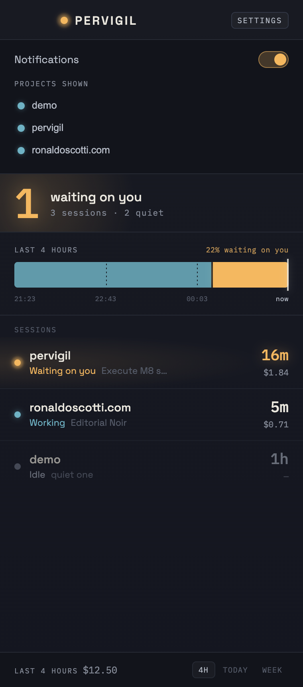
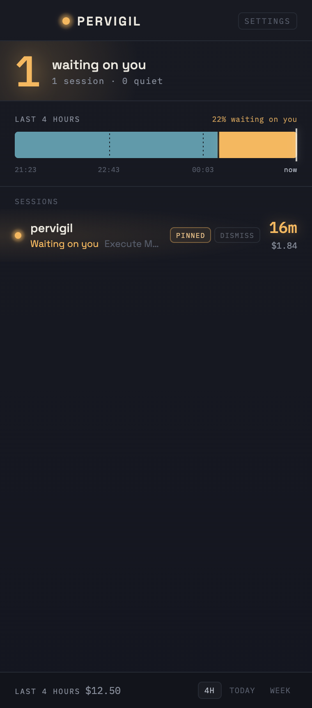

# M8 QA — notifications, config, pin/dismiss, project visibility

**Date:** 2026-07-24 · **Milestone:** M8 · **Method stage:** 6 (QA as user + as QA engineer)

## What M8 adds

- **Config** persisted to `~/.pervigil/config.json` — notifications toggle, hidden projects,
  and the pin/dismiss state that can't live in the append-only event log.
- **Native notifications** on a session *entering* `WaitingOnYou` — never while it stays waiting,
  never on `Idle`/`Working`, and silent on launch (the first snapshot only primes the baseline).
- **Pin / dismiss** per row; **project visibility** via a settings sheet.

## Verification matrix

| Claim | How | Result |
|---|---|---|
| config defaults: notifications on, nothing hidden | unit | ✅ |
| load degrades to defaults on a missing / corrupt / partial file (never panics) | unit | ✅ 3 tests |
| save→load round-trips | unit | ✅ |
| `view_prefs` carry pin/dismiss into `fold`; `shows()` filters the list | unit | ✅ |
| notification fires only on the transition *into* waiting; dedupe on staying waiting | unit (`newly_waiting`) | ✅ 4 tests |
| first snapshot primes silently; off fires nothing but still advances the baseline | unit (`notices`) | ✅ 3 tests |
| settings sheet: notifications switch + project-visibility list | `agent-browser` | ✅ |
| toggling notifications off flips the switch; hiding a project drops it from the list | `agent-browser` — switch `aria-checked=false`, rows lost "demo" | ✅ |
| pin marks the row and its control; dismiss removes the row | `agent-browser` — `is-pinned` + "Pinned"; dismissed row gone | ✅ |
| a pin/dismiss click acts on the session and does **not** also jump | `agent-browser` — no focus toast on the action click; a row-body click still toasts "Jump to pane" | ✅ |
| no horizontal overflow with the new controls | `agent-browser` — `scrollWidth == clientWidth` | ✅ |

 

## Design notes

- The settings surface stays "short and opinionated" (spec §2): one notifications switch and a
  visibility list — no timeline colors, sort order, or retention knobs, exactly as the spec's
  config philosophy prescribes. It reuses the panel's palette, mono labels, and lamp accents; no
  new visual language was invented.
- **Project visibility lives in settings, pin/dismiss on the row.** Hiding is a considered,
  reversible choice (and a hidden project may have no live row to act on), so it belongs in the
  settings list which enumerates every project. Pin/dismiss are per-session and frequent, so they
  sit on the row, revealed on hover/focus to keep the resting state calm.
- The lane and totals still aggregate **every** session, including hidden ones (spec item 4):
  visibility filters the list, not the record of your day.

## Not verified here (honest gap)

- The **native macOS notification actually appearing** on screen — the firing path
  (`tauri-plugin-notification`, permission in `capabilities/default.json`) is wired and the
  transition logic that drives it is unit-tested, but confirming the banner needs a real desktop
  session with granted permission, which this environment can't capture. Same posture as the tray
  badge and the on-screen window raise.

## Cleanup

`~/.pervigil/{config.json,events.jsonl}` created during QA were removed afterward.
