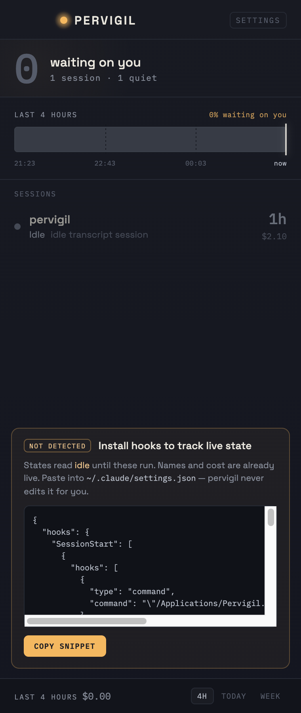

# M9 QA — hook-install UX

**Date:** 2026-07-24 · **Milestone:** M9 · **Method stage:** 6 (QA as user + as QA engineer)

## What M9 adds

Pervigil never writes `~/.claude/settings.json` (spec item 12). Instead, when the four hooks
aren't wired it shows an **install card**: the exact snippet to paste, a copy button, and a
live detected signal — the card is present while hooks are missing and vanishes the moment they
appear.

## Verification matrix

| Claim | How | Result |
|---|---|---|
| detection: empty / corrupt / hook-less settings → nothing installed | unit | ✅ |
| a full install is detected **whatever the binary path or case** (`…/Pervigil.app/…/record`) | unit | ✅ |
| a partial install is reported per-event, not rounded up to "installed" | unit | ✅ |
| a foreign hook under our event doesn't count | unit | ✅ |
| the snippet we emit satisfies our own detector (round-trip) | unit | ✅ |
| install card renders with the real snippet, copy button, "never edits it for you" | `agent-browser` | ✅ |
| **live signal**: flipping `hooksInstalled` true removes the card and toasts "Hooks detected ✓" | `agent-browser` | ✅ |
| the snippet is selectable, so the copy-failed fallback ("select manually") is real | `agent-browser` — `user-select: text` | ✅ |
| snippet scrolls inside its own box; no horizontal page overflow | `agent-browser` — `scrollWidth == clientWidth` | ✅ |

## Self-review fixes (stage 7)

- **Detection matched the brand string `pervigil`** — but an install by absolute path is
  `/Applications/Pervigil.app/Contents/MacOS/record` (capital P, lowercase never appears). A unit
  test caught the miss; detection now keys on `record` + the event name, which is path- and
  case-robust and still specific.
- **The copy fallback told the user to "select the snippet manually," but the panel sets
  `user-select: none` globally** — so the text wasn't selectable. The snippet box now opts back
  into text selection, making the fallback honest.
- Removed the dead M6-era `hooks` (log-non-empty) field; `hooksInstalled` (settings-based) is the
  real, single signal, and two hook booleans would only confuse a reader.

## Honesty note

The snippet's `record` path is resolved from the running binary's directory. In this unbundled dev
build that's `…/target/debug/record` (which exists); once M10 bundles the shim beside the app
binary, the same resolution yields the installed path. The copy button uses `navigator.clipboard`
(works in the Tauri webview under the click's user activation); the headless QA browser blocks
clipboard, which is exactly why the selectable-text fallback exists and was verified.
